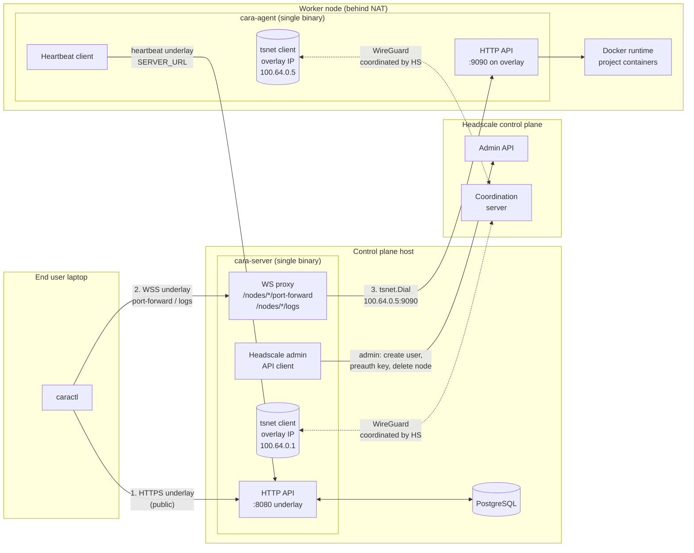
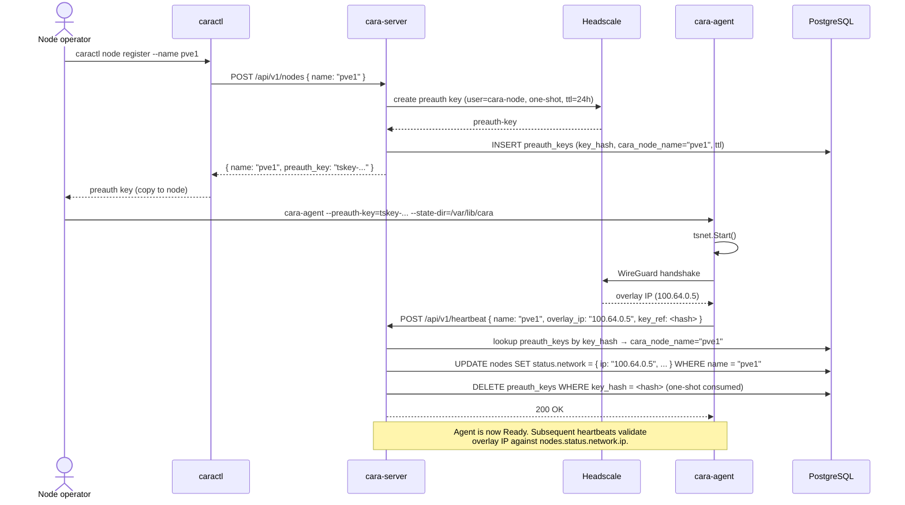

# Headscale Overlay Networking — Design

**Status**: Draft — work in progress (CARA-50)
**Related**:

- Epic: [CARA-47](https://clustron.atlassian.net/browse/CARA-47) — Build Headscale overlay networking for Cara agents
- Sibling tickets:
  [CARA-48](https://clustron.atlassian.net/browse/CARA-48) (dev deployment),
  [CARA-49](https://clustron.atlassian.net/browse/CARA-49) (node lifecycle),
  [CARA-51](https://clustron.atlassian.net/browse/CARA-51) (NAT validation),
  [CARA-52](https://clustron.atlassian.net/browse/CARA-52) (server dial via overlay),
  [CARA-53](https://clustron.atlassian.net/browse/CARA-53) (register overlay address),
  [CARA-54](https://clustron.atlassian.net/browse/CARA-54) (health reporting),
  [CARA-55](https://clustron.atlassian.net/browse/CARA-55) (agent join flow)

> All architectural decisions listed as **Q1–Q6** in the design discussions are
> now resolved; remaining items are tracked in section 11 as non-blocking open
> questions.

## 1. Motivation

Cara currently assumes direct L3 reachability between `cara-server` and every
`cara-agent`. In real deployments agents live behind NAT, on user laptops, or
in isolated networks, so the server cannot reliably reach them for API calls,
port-forward, exec, log streaming, and health checks.

This epic introduces a **Headscale-based overlay network** (WireGuard mesh
managed by a self-hosted Headscale control plane) so that every agent joins a
private overlay, obtains a stable overlay IP, and becomes reachable from the
server regardless of the underlying network topology.

Headscale is chosen because it is open-source, self-hostable, and compatible
with the official Tailscale client.

## 2. Non-goals (1.0)

The following are explicitly deferred to a later iteration:

| Non-goal | Reason for deferral |
|---|---|
| Headscale ACLs / fine-grained policy | Not required to make basic NAT traversal work; add once overlay is proven |
| Multi-tenant isolation on the overlay | Cara itself is single-tenant in 1.0; overlay tenancy would be dead code |
| HA / clustered Headscale deployment | Adds operational complexity; single Headscale is acceptable for 1.0 |
| Custom DERP relay tuning | Tailscale's public DERP servers are sufficient for 1.0 |
| Web UI dashboard for overlay state | `caractl` output covers 1.0 observability needs |

## 3. Architecture overview



**Legend**

- **Solid arrows** — TCP/HTTP traffic (application layer).
- **Dashed arrows** — WireGuard control-plane coordination (nodes negotiate
  peer keys and DERP relays through Headscale, then send data plane traffic
  peer-to-peer or via DERP without transiting Headscale itself).
- **Underlay** — the pre-existing internet path (`caractl → server`, `agent
  heartbeat → server`). Does not depend on the overlay.
- **Overlay** — the WireGuard mesh (`server ↔ agent` for port-forward / logs /
  exec). Only used for `server → agent` RPCs.

**Three key properties visible in this diagram:**

1. `caractl` never touches Headscale or the overlay — it is always an underlay
   HTTP client of `cara-server`.
2. `cara-server` is the only Headscale admin client (HSClient → HSAPI). The
   `preauth_keys` table lives in the same PostgreSQL that owns Node state.
3. Agent → server traffic (heartbeat) stays on the underlay, so overlay
   outages do not affect node liveness reporting. Server → agent traffic
   (port-forward / logs) runs on the overlay, which is what solves NAT.

## 4. Node identity

**Decision (Q2): Option B — pre-auth key bound to identity.**

### 4.1 Model

The mapping between a Cara `Node` and a Headscale node is maintained on the
`cara-server` side through the pre-auth key. It is *not* enforced by making
hostnames match.

```
Cara Node               (server-side mapping)          Headscale node
  metadata.name          preauth_keys(key, cara_node)    user, hostname, overlay IP
  ────────────           ─────────────────────────      ──────────────────────────
  "PVE1_Server.03"  ◀──  key=tskey-abc, node="PVE1_Server.03"  ──▶  hostname="docker-host-07"
                                                                     overlay IP=100.64.0.7
```

When the agent joins the overlay (`tailscale up --authkey=<key>`), the
`cara-agent` may choose any hostname it likes (typically the OS hostname). The
`cara-server` reverses the mapping via the `preauth_keys` table when the agent
first heartbeats with the pre-auth key reference.

### 4.2 Rationale

- **Cara `metadata.name` remains free of Tailscale hostname constraints**
  (`[a-z0-9-]`, ≤ 63 chars). Names such as `PVE1_Server.03` or entries
  imported from other systems still work.
- **Rename is cheap**: renaming a Cara Node only requires updating the mapping
  row; the Headscale node keeps its identity and overlay IP.
- **Explicit trust boundary**: each pre-auth key carries a documented target
  (`cara_node_name`, `issued_by`, `expires_at`, `used_by_ip`) that can be
  audited.
- **Future-proofs multi-tenant / namespace work**: the mapping table can be
  extended with `tenant` without renaming any Headscale nodes.

### 4.3 Trade-offs accepted

- Server maintains a `preauth_keys` mapping table (schema owned by
  [CARA-53](https://clustron.atlassian.net/browse/CARA-53)).
- Debugging requires cross-referencing Cara name and Headscale hostname
  (`caractl describe node` must surface both).
- Pre-auth keys must be **one-shot** (see section 5) to keep the mapping
  unambiguous.

## 5. Pre-auth key model

**Decision (Q3): one-shot, non-ephemeral, TTL 24h (configurable).**

| Attribute | Value | Reason |
|---|---|---|
| Reusable | ❌ one-shot | Under section 4, one key ↔ one Cara Node. Reusable keys would break the mapping. |
| Ephemeral | ❌ non-ephemeral | Cara Nodes are long-lived; ephemeral would drop the node after brief disconnects and rotate its overlay IP on every rejoin. |
| TTL | 24 h default (`--ttl` overridable) | Limits blast radius of a leaked but unused key. 24 h is long enough for scheduled provisioning yet short enough to force hygiene. |

### 5.1 Lifecycle

```
[admin]  caractl overlay create-preauth-key --node <name> [--ttl 24h]
             │
             ▼ HTTP
[cara-server]  POST /api/v1/overlay/preauth-keys
                 └── Headscale admin API: create key (user=cara-node, one-shot, TTL)
                 └── DB: insert preauth_keys(key, cara_node_name, expires_at, issued_by, state=active)
             │
             ▼
[admin]  copies key to agent's config / provisioning script (out of band)
             │
             ▼
[cara-agent on target host]  tailscale up --authkey=<key> --hostname=<free>
             │
             ▼
[Headscale]  key marked used; node record created with an overlay IP
             │
             ▼
[cara-agent]  reports (overlayIP, headscaleNodeID, preauthKeyRef) via heartbeat
             │
             ▼
[cara-server]  looks up preauth_keys[key].cara_node_name → updates that Node's
               status.network.ip; marks key state=used
```

### 5.2 Key states

- `active` — issued, not yet used, not expired.
- `used` — consumed by an agent; retained for audit.
- `expired` — TTL elapsed before use; Headscale will refuse; server surfaces
  in `caractl overlay keys list`.
- `revoked` — explicitly cancelled via `caractl overlay revoke-key`; server
  calls Headscale delete API, retains DB row.

### 5.3 Edge cases

- **Node re-provisioning**: revoke old Headscale node, issue new key, agent
  joins fresh with a new overlay IP; server updates `status.network.ip` in
  place — the Cara Node identity is unchanged.
- **Key leaked**: `caractl overlay revoke-key` immediately; DB row retained
  for audit trail.
- **Key produced but never used**: expires automatically after TTL; no server
  action required.
- **Agent retries `tailscale up` after key was already used**: Headscale
  rejects (one-shot); agent must obtain a fresh key.

## 6. IP model and traffic flow

### 6.1 Directional summary

| Direction | Transport | Notes |
|---|---|---|
| Server → Agent (API calls, port-forward setup, logs, health probe) | **Overlay** | Canonical path. Underlay fallback allowed only under explicit configuration (owned by [CARA-52](https://clustron.atlassian.net/browse/CARA-52)). |
| Agent → Server (register, heartbeat, poll projects, report status) | **Underlay** (`SERVER_URL`) | Unchanged from today. Server keeps its public HTTPS endpoint. Rationale: bootstrap independence — agent can heartbeat even if overlay is degraded. |
| caractl → Server (all CRUD / describe / apply / delete) | **Underlay** | Server's public HTTPS endpoint. `caractl` users do not need Tailscale installed for day-to-day commands. |
| caractl → Agent (tunneling: `port-forward`, `logs`, future `exec`) | **Server-side proxy (C2)** | `caractl` opens a WebSocket to `cara-server`; the server proxies bidirectionally to the agent over the overlay. |

### 6.2 Rationale for `caractl → Agent` via server proxy

- `caractl` is the interface every developer / operator uses, not just SREs.
  Forcing every user to install a Tailscale client to run `caractl logs` or
  `caractl port-forward` breaks the "kubectl-style" single-endpoint UX Cara
  aims for.
- Cost: `cara-server` adds a WebSocket bidi proxy handler
  (`/api/v1/nodes/<name>/port-forward`, `/api/v1/nodes/<name>/logs`). One-time
  engineering effort; no new binary or deployment component.
- Benefit: single trust boundary (server-side auth applies to tunnels too);
  no admin-device onboarding required.

### 6.3 Underlay fallback (server → agent)

Owned by CARA-52. Overlay is the default. An explicit configuration flag on
`cara-server` may cause the dialer to fall back to a stored underlay address
for a specific Node when overlay is unreachable. This exists mainly for the
transitional period while nodes are still being migrated onto the overlay and
should not be relied upon in steady state.

## 7. Trust boundary

### 7.1 Actors on the overlay

| Actor | Headscale user | Join method | Key policy |
|---|---|---|---|
| `cara-agent` (per node) | `cara-node` | Pre-auth key issued by server on request | One-shot, non-ephemeral, TTL 24h (see §5) |
| `cara-server` | `cara-control` | Pre-auth key issued once at bootstrap | **Long-lived, non-ephemeral, one-shot** — used once at first start, never regenerated for the same server identity |
| Admin devices | N/A (v1) | N/A | Not on the overlay in v1. `caractl` reaches agents through the server-side WebSocket proxy (§6). |

### 7.2 Pre-auth key issuance rules

- **Only `cara-server` calls the Headscale admin API.** `caractl` never touches
  Headscale directly (see [CARA-49](https://clustron.atlassian.net/browse/CARA-49)).
- **Key format**: Headscale-generated opaque token; never logged in full;
  server persists `key_prefix` (first 8 chars) plus a hash for audit.
- **Revocation**: `cara-server` is the sole writer of `preauth_keys` state and
  the sole caller of Headscale delete-node / delete-key APIs.
- **Two Headscale users, not one.** Isolating `cara-control` from `cara-node`
  means an agent's stolen credentials cannot impersonate the server, and
  Headscale ACLs (v2 non-goal) can later restrict node-to-node traffic without
  affecting the server's control-plane reachability.

### 7.3 Server bootstrap key

The `cara-control` pre-auth key is issued **once** during initial Headscale
bootstrap (typically an operator running `headscale preauthkeys create --user
cara-control --reusable=false --expiration=8760h` or similar) and stored in
the server's secret store. It is consumed once at first server start; after
that, `tsnet` reuses the persisted node identity in `--state-dir` and does not
need the key again.

Rekey / rotation is out of scope for v1: if the server needs a new overlay
identity, the operator re-issues a fresh pre-auth key, wipes the server's
`tsnet` state directory, and restarts.

## 8. Tailscale integration mode

Both `cara-server` and `cara-agent` embed the overlay client in-process using
the [`tailscale.com/tsnet`](https://pkg.go.dev/tailscale.com/tsnet) Go library.
Neither host requires the standalone `tailscaled` daemon, `CAP_NET_ADMIN`,
`/dev/net/tun`, or any kernel network interface.

### 8.1 Why tsnet on both sides

| Concern | tsnet (chosen) | External tailscaled (rejected) |
|---|---|---|
| Node operator onboarding | `cara-agent --preauth-key=<k>` and nothing else | Install tailscale package + `tailscale up` + then start agent |
| Container / K8s deployment | Works in an unprivileged container | Requires privileged container or host-network + `/dev/net/tun` |
| Binary self-containment | Single binary carries all dependencies | External systemd unit / package manager dependency |
| Blast radius of overlay | Only the `cara-*` process | Every process on the host (including debug shells, unrelated daemons) |
| Failure isolation | Process crash resets only overlay; host untouched | tailscaled outage affects unrelated services on the host |
| CLI debugging | Inspect via cara-server API and structured logs | `tailscale status` on the host |

The last row is the only argument in favour of external `tailscaled`, and it is
outweighed by the onboarding and containerisation wins. All operational
inspection MUST go through `cara-server`'s API (`caractl get node`,
`caractl describe node`, structured logs) rather than SSH'ing into agent hosts.

### 8.2 Consequences

- `cara-agent` links `tailscale.com/tsnet` and gains a modest binary size
  increase. This is acceptable — the agent is a control-plane component, not a
  size-sensitive sidecar.
- The overlay interface exposed by `tsnet` is **only usable by the hosting
  process**. Project containers scheduled on the same node CANNOT see the
  overlay. This is intentional: overlay is a control-plane concern (agent ↔
  server), not a workload concern.
- `cara-server` uses `tsnet.Server.Dial` to reach agents by overlay IP, and
  keeps its underlay HTTP listener (`:8080`) unchanged for `caractl` traffic.
- `cara-agent` uses `tsnet.Server.Listen` for its agent HTTP endpoint, and
  keeps its underlay heartbeat client unchanged (pointing at `SERVER_URL`).

### 8.3 Configuration surface

Both binaries accept the same set of flags/env vars:

| Field | Description |
|---|---|
| `--headscale-url` | Base URL of the Headscale control plane |
| `--preauth-key` | One-shot key used to join the overlay (agent only; server uses a long-lived key or a separate admin identity — see §7) |
| `--hostname` | Overlay hostname (defaults to the Cara node name) |
| `--state-dir` | Directory where `tsnet` persists its node key and machine state across restarts |

The `--state-dir` requirement is important: `tsnet` writes its private node
identity to disk. Losing this directory forces a rejoin (see §10 for the
"lost state" failure mode).

## 9. Bootstrap sequences

Two flows: initial server bootstrap (once per cluster) and per-agent join
(every time a node is added).

### 9.1 Server bootstrap (one-time)

```mermaid
sequenceDiagram
  actor Op as Operator
  participant HS as Headscale
  participant Srv as cara-server
  participant DB as PostgreSQL

  Op->>HS: headscale users create cara-control
  Op->>HS: headscale preauthkeys create --user cara-control --reusable=false --expiration=8760h
  HS-->>Op: preauth-key (long-lived, one-shot)
  Op->>Srv: deploy with --preauth-key + --headscale-url + --state-dir
  Srv->>Srv: tsnet.Start()
  Srv->>HS: WireGuard handshake using preauth-key
  HS-->>Srv: overlay IP (100.64.0.1)
  Srv->>Srv: persist node identity to --state-dir
  Srv->>DB: migrate preauth_keys, nodes tables
  Note over Srv: Server is now on overlay as 100.64.0.1.<br/>Preauth key is consumed; will not be reused.
```

### 9.2 Agent join (per node)



## 10. Failure modes

| # | Failure | Symptom | Detector | Surfacing | Recovery |
|---|---|---|---|---|---|
| 1 | Headscale unreachable at server start | `cara-server` cannot join overlay; underlay API still works | `tsnet.Start()` returns error, retried with backoff | Server logs + Prometheus `cara_overlay_up = 0`; caractl port-forward returns 503 with "server overlay down" | Operator restarts Headscale; server retries automatically. Agents remain Ready (no server→agent RPCs land until server rejoins). |
| 2 | Headscale unreachable at agent start | Agent cannot obtain overlay IP; heartbeat has no `overlay_ip` field | Agent-side `tsnet` handshake timeout | Agent stays in `Pending` (never transitions to Ready); server marks node `Unknown` after heartbeat timeout ([CARA-54](https://clustron.atlassian.net/browse/CARA-54)) | Operator confirms Headscale reachable from node; agent retries on interval. |
| 3 | Pre-auth key expired before first use | Agent gets 401 from Headscale during handshake | Agent handshake returns explicit "key expired" | Agent logs error; heartbeat NOT sent; node stays absent in `caractl get nodes` | Operator runs `caractl node register` again to reissue key. Server garbage-collects expired keys via periodic sweep. |
| 4 | Overlay IP reused after node revoke + rejoin | New agent process claims same overlay IP that an old (revoked) node used | Server detects `preauth_keys.cara_node_name` on heartbeat resolves to a name that already exists with a different key ref | Server responds 409 to heartbeat; logs incident | Operator revokes stale node explicitly (`caractl node delete`) before rejoin, then reissues key. |
| 5 | Agent overlay interface flaps | Server intermittently cannot reach agent overlay IP | `tsnet.Dial` timeout / connection reset from server side | Server marks node condition `OverlayReachable=False`; port-forward / logs return 503 with reason | Automatic — resolves when `tsnet` reconnects. Agent underlay heartbeat continues so node does NOT flip to `Unknown`. |
| 6 | Server `--state-dir` lost | Server restarts and cannot resume overlay identity | `tsnet.Start()` finds no state; treats as new node; original preauth-key already consumed | Server fails to start (fatal), logs "no state and no valid preauth-key" | Operator regenerates a preauth key for `cara-control`, wipes any partial state, restarts. |
| 7 | Cara node rename while overlay identity persists | `nodes.metadata.name` changed but Headscale still knows the old hostname | Heartbeat carries updated Cara name, but `preauth_keys` lookup returns different name | Server rejects heartbeat with 409 "identity mismatch"; requires explicit revoke + rejoin | Operator deletes and re-registers the node under the new name. Rename is not supported in v1. |

Rows 1, 2, 5 are the expected steady-state failures and MUST be observable
through `caractl get nodes -o wide` and Prometheus. Rows 3, 4, 6, 7 are
operator-driven and can rely on error surfacing in logs and CLI output.

## 11. Open questions

- Whether to expose overlay MagicDNS names in `Node.status.network.dnsName`
  or to keep only the numeric overlay IP as authoritative. Current lean:
  keep numeric IP authoritative in v1; add MagicDNS as an optional cosmetic
  field for `caractl describe node` once Headscale MagicDNS is proven stable
  in our deployment.
- Whether the periodic garbage-collection sweep for expired `preauth_keys`
  belongs in the same controller loop as node reconciliation or in a
  dedicated janitor (see [CARA-53](https://clustron.atlassian.net/browse/CARA-53)).
- Whether pre-auth keys should be delivered to the node operator through
  `caractl` stdout (current plan) or a downloadable one-time bundle
  (config + key). Impacts operator UX only, not the protocol.

## Changelog

- 2026-07-13 — Q5 resolved (`tsnet` on both server and agent), Q6 resolved
  (server also uses a long-lived one-shot preauth key under Headscale user
  `cara-control`). §3 architecture diagram, §7 trust boundary, §8 tailscale
  integration, §9 bootstrap sequences, and §10 failure modes finalised.
  Status remains Draft pending implementation review; content is complete.
- 2026-07-07 — Initial draft; sections 1–7 reflect Q1–Q4b design discussions.
  Sections 8–10 are placeholders; do not implement against them.
