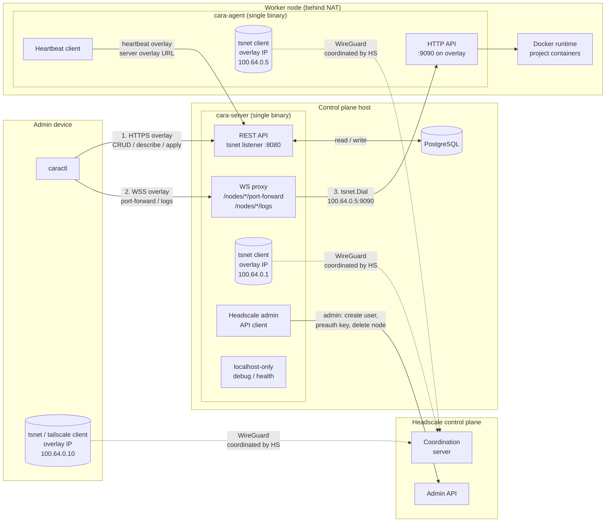
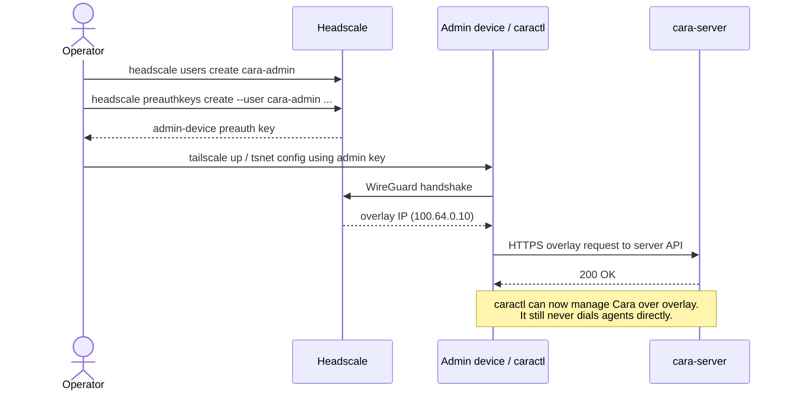
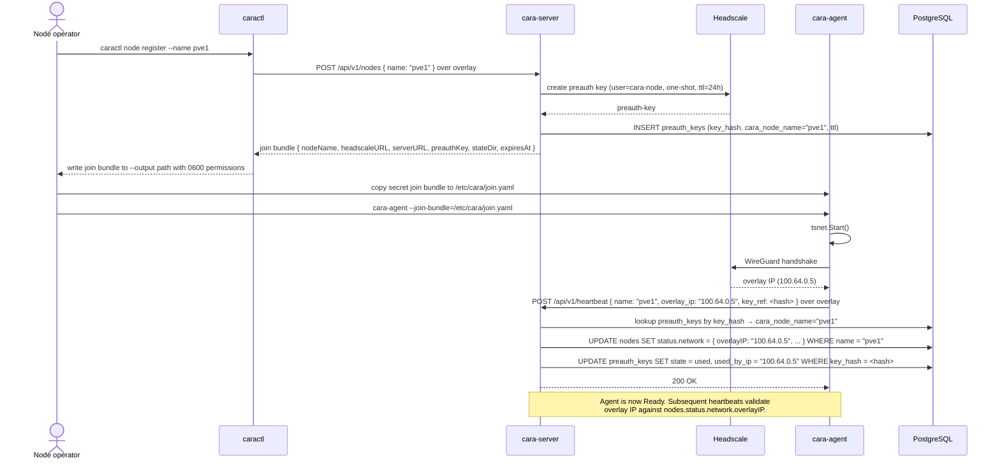

# Headscale Overlay Networking — Design


## 1. Motivation

Cara currently assumes direct L3 reachability between `cara-server` and every
`cara-agent`. In real deployments agents live behind NAT, on user laptops, or
in isolated networks, so the server cannot reliably reach them for API calls,
port-forward, exec, log streaming, and health checks.

This epic introduces a **Headscale-based overlay network** (WireGuard mesh
managed by a self-hosted Headscale control plane) so that every agent joins a
private overlay, obtains a stable overlay IP, and becomes reachable from the
server regardless of the underlying network topology.

## 2. Architecture overview



**Legend**

- **Solid arrows** — TCP/HTTP traffic (application layer).
- **Dashed arrows** — WireGuard control-plane coordination (nodes negotiate
  peer keys and DERP relays through Headscale, then send data plane traffic
  peer-to-peer or via DERP without transiting Headscale itself).
- **Underlay** — the ordinary internet / LAN path used only to reach the
  Headscale coordination service and any localhost-only debug endpoint. Cara's
  control-plane API does not use underlay transport in v1.
- **Overlay** — the WireGuard mesh used for every Cara control-plane flow:
  `caractl ↔ server`, `agent ↔ server`, and server-mediated streams to agents.

**Three key properties visible in this diagram:**

1. `caractl` runs from an admin device that has already joined the overlay
   under the `cara-admin` Headscale user. It never calls agents directly.
2. `cara-server` is the only Headscale admin API client (HSClient → HSAPI). The
   `preauth_keys` table lives in the same PostgreSQL that owns Node state.
3. Agent heartbeat, status reporting, project polling, server→agent RPCs, and
   `caractl` REST/WSS calls all use overlay transport. `cara-server` does not
   expose a public underlay control-plane API.

## 3. Node identity

Cara node identity is owned by Cara; Headscale node identity is owned by the
overlay. The server links the two through the pre-auth key record created during
node registration.

### 3.1 Model

The mapping between a Cara `Node` and a Headscale node is maintained on the
`cara-server` side through the pre-auth key. It is *not* enforced by making
hostnames match.

```
Cara Node               (server-side mapping)          Headscale node
  metadata.name          preauth_keys(key_hash, node)    user, hostname, overlay IP
  ────────────           ─────────────────────────      ──────────────────────────
  "PVE1_Server.03"  ◀──  key=tskey-abc, node="PVE1_Server.03"  ──▶  hostname="docker-host-07"
                                                                     overlay IP=100.64.0.7
```

When the agent joins the overlay from its secret join bundle, the `cara-agent`
may choose any hostname it likes (typically the OS hostname). The `cara-server`
reverses the mapping via the `preauth_keys` table when the agent first
heartbeats with the pre-auth key reference.

### 3.2 Rationale

- **Cara `metadata.name` remains free of Tailscale hostname constraints**
  (`[a-z0-9-]`, ≤ 63 chars). Names such as `PVE1_Server.03` or entries
  imported from other systems still work.
- **Rename is cheap**: renaming a Cara Node only requires updating the mapping
  row; the Headscale node keeps its identity and overlay IP.
- **Explicit trust boundary**: each pre-auth key carries a documented target
  (`cara_node_name`, `issued_by`, `expires_at`, `used_by_ip`) that can be
  audited.
- **Future-proofs multi-tenant / namespace work**: the mapping table can be
  extended with `tenant` without renaming any Headscale nodes.

## 4. Pre-auth key model

**one-shot, non-ephemeral, TTL 24h (configurable).**

When a new agent is registered, `cara-server` creates a one-shot Headscale
pre-auth key and returns it inside a secret join bundle. The key binds one Cara
Node to one future Headscale node.

| Attribute | Value | Reason |
|---|---|---|
| Reusable | ❌ one-shot | Under section 3, one key ↔ one Cara Node. Reusable keys would break the mapping. |
| Ephemeral | ❌ non-ephemeral | Cara Nodes are long-lived; ephemeral would drop the node after brief disconnects and rotate its overlay IP on every rejoin. |
| TTL | 24 h default (`--ttl` overridable) | Limits blast radius of a leaked but unused key. 24 h is long enough for scheduled provisioning yet short enough to force hygiene. |

### 4.1 Lifecycle

```
[admin device on overlay]  caractl node register --name <name> --output <bundle.yaml> [--ttl 24h]
             │
             ▼ HTTPS overlay
[cara-server]  POST /api/v1/nodes
                 └── Headscale admin API: create key (user=cara-node, one-shot, TTL)
                 └── DB: insert preauth_keys(key_hash, key_prefix, cara_node_name, expires_at, issued_by, state=active)
             │
             ▼
[admin]  copies secret join bundle to agent host (out of band)
             │
             ▼
[cara-agent on target host]  cara-agent --join-bundle=/etc/cara/join.yaml
             │
             ▼
[Headscale]  key marked used; node record created with an overlay IP
             │
             ▼
[cara-agent]  reports (overlayIP, headscaleNodeID, preauthKeyRef) via heartbeat
             │
             ▼
[cara-server]  looks up preauth_keys[key].cara_node_name → updates that Node's
               status.network.overlayIP; marks key state=used
```

### 4.2 Key states

- `active` — issued, not yet used, not expired.
- `used` — consumed by an agent; retained for audit.
- `expired` — TTL elapsed before use; Headscale will refuse; server surfaces
  in `caractl overlay keys list`.
- `revoked` — explicitly cancelled via `caractl overlay revoke-key`; server
  calls Headscale delete API, retains DB row.

## 5. IP model and traffic flow

### 5.1 Directional summary

| Direction | Transport | Notes |
|---|---|---|
| Server → Agent (API calls, port-forward setup, logs, health probe) | **Overlay** | Canonical and only path. Dial by the agent's authoritative overlay IP. |
| Agent → Server (register, heartbeat, poll projects, report status) | **Overlay** | Agent must join Headscale before it can register or heartbeat. |
| caractl → Server (all CRUD / describe / apply / delete) | **Overlay** | Admin device must join Headscale before running `caractl` against the cluster. |
| caractl → Agent (tunneling: `port-forward`, `logs`, future `exec`) | **Server-side proxy over overlay** | `caractl` opens an overlay WebSocket to `cara-server`; the server proxies bidirectionally to the agent over the overlay. |

### 5.2 Rationale for `caractl → Agent` via server proxy

- `caractl` is the single Cara API client. Even though admin devices are on the
  overlay, forcing `caractl` to dial agents directly would push node discovery,
  stream authorization, and audit concerns into every agent.
- Cost: `cara-server` adds a WebSocket bidi proxy handler
  (`/api/v1/nodes/<name>/port-forward`, `/api/v1/nodes/<name>/logs`). One-time
  engineering effort; no new binary or deployment component.
- Benefit: single trust boundary (server-side auth applies to tunnels too);
  agents only trust `cara-server`, not every admin device.

### 5.3 Addressing model

The Headscale-assigned overlay IP is the authoritative address for server→agent
dialing and is stored in `Node.status.network.overlayIP`. `cara-server` uses
that IP when opening agent RPCs and tunnel streams.

MagicDNS names are optional debug metadata shown by `caractl describe node`.
They are not stored in `Node.status.network` and are not authoritative in v1.
DNS configuration, hostname constraints, or MagicDNS outages must not break
normal Cara operation when the overlay IP is known.

There is no underlay fallback for server→agent traffic in v1. If an overlay dial
fails, the server reports the error to the caller and updates node conditions as
described in section 9.

## 6. Trust boundary

### 6.1 Actors on the overlay

| Actor | Headscale user | Join method | Key policy |
|---|---|---|---|
| `cara-agent` (per node) | `cara-node` | Pre-auth key issued by server on request | One-shot, non-ephemeral, TTL 24h (see §4) |
| `cara-server` | `cara-control` | Pre-auth key issued once at bootstrap | **Long-lived, non-ephemeral, one-shot** — used once at first start, never regenerated for the same server identity |
| Admin devices running `caractl` | `cara-admin` | Pre-auth key issued by operator / Headscale ops flow | Non-ephemeral; TTL and reuse policy are deployment-specific, but keys must be handled as admin credentials |

### 6.2 Pre-auth key issuance rules

- **Only `cara-server` calls the Headscale admin API for Cara nodes.**
  `caractl` never creates agent keys directly; it asks `cara-server` over the
  overlay. Operator-managed bootstrap may use Headscale tooling to provision
  the initial `cara-control` and `cara-admin` identities.
- **Key format**: Headscale-generated opaque token; never logged in full;
  server persists `key_prefix` (first 8 chars) plus a hash for audit.
- **Revocation**: `cara-server` is the sole writer of `preauth_keys` state and
  the sole caller of Headscale delete-node / delete-key APIs.
- **Three Headscale users, not one.** Isolating `cara-control`, `cara-node`,
  and `cara-admin` means stolen agent credentials cannot impersonate the server
  or an admin device. Headscale ACLs (v2 non-goal) can later restrict admin
  devices to `cara-server`, restrict agents to `cara-server`, and prevent
  agent-to-agent traffic without changing Cara's protocol.

### 6.3 Server bootstrap key

The `cara-control` pre-auth key is issued **once** during initial Headscale
bootstrap (typically an operator running `headscale preauthkeys create --user
cara-control --reusable=false --expiration=8760h` or similar) and stored in
the server's secret store. It is consumed once at first server start; after
that, `tsnet` reuses the persisted node identity in `--state-dir` and does not
need the key again.

Rekey / rotation is out of scope for v1: if the server needs a new overlay
identity, the operator re-issues a fresh pre-auth key, wipes the server's
`tsnet` state directory, and restarts.

### 6.4 Admin device bootstrap

Admin devices are intentionally outside Cara's self-service flow because they
are needed before any overlay-only `cara-server` API is reachable. An operator
uses Headscale tooling or an equivalent infrastructure process to create the
`cara-admin` user and issue admin-device pre-auth keys. After the admin device
joins the overlay, `caractl` can reach the `cara-server` overlay API and request
agent join bundles.

Admin-device keys are administrative credentials. The v1 design does not define
per-user RBAC inside Headscale; Cara authorization remains enforced by
`cara-server` once a request reaches the overlay API.

## 7. Tailscale integration mode

Both `cara-server` and `cara-agent` embed the overlay client in-process using
the [`tailscale.com/tsnet`](https://pkg.go.dev/tailscale.com/tsnet) Go library.
Neither host requires the standalone `tailscaled` daemon, `CAP_NET_ADMIN`,
`/dev/net/tun`, or any kernel network interface.

### 7.1 Why tsnet on both sides

| Concern | tsnet (chosen) | External tailscaled (rejected) |
|---|---|---|
| Node operator onboarding | `cara-agent --join-bundle=/etc/cara/join.yaml` and nothing else | Install tailscale package + `tailscale up` + then start agent |
| Container / K8s deployment | Works in an unprivileged container | Requires privileged container or host-network + `/dev/net/tun` |
| Binary self-containment | Single binary carries all dependencies | External systemd unit / package manager dependency |
| Blast radius of overlay | Only the `cara-*` process | Every process on the host (including debug shells, unrelated daemons) |
| Failure isolation | Process crash resets only overlay; host untouched | tailscaled outage affects unrelated services on the host |
| CLI debugging | Inspect via cara-server API and structured logs | `tailscale status` on the host |

The last row is the only argument in favour of external `tailscaled`, and it is
outweighed by the onboarding and containerisation wins. All operational
inspection MUST go through `cara-server`'s API (`caractl get node`,
`caractl describe node`, structured logs) rather than SSH'ing into agent hosts.

### 7.2 Consequences

- `cara-agent` links `tailscale.com/tsnet` and gains a modest binary size
  increase. This is acceptable — the agent is a control-plane component, not a
  size-sensitive sidecar.
- The overlay interface exposed by `tsnet` is **only usable by the hosting
  process**. Project containers scheduled on the same node CANNOT see the
  overlay. This is intentional: overlay is a control-plane concern (agent ↔
  server), not a workload concern.
- `cara-server` uses `tsnet.Server.Dial` to reach agents by overlay IP, and
  exposes its main REST/WSS API through a `tsnet` overlay listener.
- `cara-agent` uses `tsnet.Server.Listen` for its agent HTTP endpoint, and
  sends heartbeat / status / project polling requests to the server's overlay
  URL.
- `cara-server` MAY expose a localhost-only debug / health endpoint for process
  readiness, metrics, and overlay diagnostics. That endpoint MUST NOT provide
  Cara CRUD APIs, heartbeat ingestion, logs, port-forward, exec, or any other
  control-plane operation. It exists only for local troubleshooting and
  infrastructure health checks.

### 7.3 Configuration surface

The overlay-enabled commands accept the relevant subset of these flags/env vars:

| Field | Description |
|---|---|
| `--headscale-url` | Base URL of the Headscale control plane |
| `--preauth-key` | One-shot key used to join the overlay (agent join bundle; server uses a long-lived key or a separate admin identity — see §6) |
| `--hostname` | Overlay hostname (defaults to the Cara node name) |
| `--state-dir` | Directory where `tsnet` persists its node key and machine state across restarts |
| `--server-url` | Server overlay URL used by agents and `caractl` |
| `--debug-listen` | Optional localhost-only debug / health listener; never a control-plane API |

The `--state-dir` requirement is important: `tsnet` writes its private node
identity to disk. Losing this directory forces a rejoin (see §9 for the
"lost state" failure mode).

## 8. Bootstrap sequences

Three flows: initial server bootstrap (once per cluster), admin device join
(before `caractl` can manage the cluster), and per-agent join (every time a node
is added).

### 8.1 Server bootstrap (one-time)

```mermaid
sequenceDiagram
  actor Op as Operator
  participant HS as Headscale
  participant Srv as cara-server
  participant DB as PostgreSQL

  Op->>HS: headscale users create cara-control
  Op->>HS: headscale preauthkeys create --user cara-control --reusable=false --expiration=8760h
  HS-->>Op: preauth-key (long-lived, one-shot)
  Op->>Srv: deploy with --preauth-key + --headscale-url + --state-dir
  Srv->>Srv: tsnet.Start()
  Srv->>HS: WireGuard handshake using preauth-key
  HS-->>Srv: overlay IP (100.64.0.1)
  Srv->>Srv: persist node identity to --state-dir
  Srv->>Srv: start REST/WSS API on tsnet overlay listener
  Srv->>DB: migrate preauth_keys, nodes tables
  Note over Srv: Server API is reachable only on overlay as 100.64.0.1.<br/>Preauth key is consumed; will not be reused.
```

### 8.2 Admin device join



### 8.3 Agent join (per node)



The join bundle contains a live Headscale pre-auth key and MUST be treated as a
secret. `caractl node register --output <path>` writes it on the admin device
with `0600` permissions and prints only the path, expiry, and handling
instructions. Operators copy it to the target agent host through their normal
secret transport (`scp`, cloud-init secret data, Ansible Vault, a secret
manager, or equivalent). `cara-server` stores only key hashes / prefixes and
audit metadata, never the full key in plaintext.

## 9. Failure modes

| # | Failure | Symptom | Detector | Surfacing | Recovery |
|---|---|---|---|---|---|
| 1 | Headscale unreachable at server start | `cara-server` cannot join overlay; main REST/WSS API is not served | `tsnet.Start()` returns error, retried with backoff | Server logs, localhost-only debug / health reports not ready, infra monitoring reports overlay down | Operator restores Headscale reachability. Server keeps retrying and starts its overlay listener only after join succeeds. |
| 2 | Headscale unreachable for admin device | `caractl` cannot reach the overlay-only server API | Admin device cannot join overlay or cannot route to server overlay IP | `caractl` connection error; infra monitoring / Headscale status | Operator restores Headscale or admin-device connectivity. No underlay Cara API exists as fallback. |
| 3 | Headscale unreachable at agent start | Agent cannot obtain overlay IP and cannot heartbeat | Agent-side `tsnet` handshake timeout | Agent local logs / localhost debug report not ready; server marks node `Unknown` after heartbeat timeout ([CARA-54](https://clustron.atlassian.net/browse/CARA-54)) | Operator confirms Headscale reachable from node; agent retries on interval. |
| 4 | Pre-auth key expired before first use | Agent gets 401 from Headscale during handshake | Agent handshake returns explicit "key expired" | Agent logs error; heartbeat NOT sent; node stays absent or `Unknown` in `caractl get nodes` | Operator runs `caractl node register` again to reissue a fresh join bundle. Server garbage-collects expired keys via periodic sweep. |
| 5 | Overlay IP reused after node revoke + rejoin | New agent process claims same overlay IP that an old (revoked) node used | Server detects `preauth_keys.cara_node_name` on heartbeat resolves to a name that already exists with a different key ref | Server responds 409 to heartbeat; logs incident | Operator revokes stale node explicitly (`caractl node delete`) before rejoin, then reissues key. |
| 6 | Agent overlay interface flaps | Agent heartbeat stops and server→agent dials fail intermittently | Heartbeat timeout and `tsnet.Dial` timeout / connection reset from server side | Server marks node `Unknown` after heartbeat timeout and sets `OverlayReachable=False` when server→agent dial fails; port-forward / logs return 503 with reason | Automatic — resolves when `tsnet` reconnects and heartbeat resumes. |
| 7 | Server `--state-dir` lost | Server restarts and cannot resume overlay identity | `tsnet.Start()` finds no state; treats as new node; original preauth-key already consumed | Server never serves main API; localhost debug / health reports not ready; logs "no state and no valid preauth-key" | Operator regenerates a preauth key for `cara-control`, wipes any partial state, restarts. |
| 8 | Cara node rename while overlay identity persists | `nodes.metadata.name` changed but Headscale still knows the old hostname | Heartbeat carries updated Cara name, but `preauth_keys` lookup returns different name | Server rejects heartbeat with 409 "identity mismatch"; requires explicit revoke + rejoin | Operator deletes and re-registers the node under the new name. Rename is not supported in v1. |

Rows 1, 2, 3, and 6 are the expected steady-state failures. When `caractl` can
reach the server overlay API, node-level symptoms MUST be observable through
`caractl get nodes -o wide` and Prometheus. When the server or admin device
cannot join the overlay, operators rely on Headscale / infrastructure
monitoring plus localhost-only debug / health on the affected process. Rows 4,
5, 7, and 8 are operator-driven and can rely on error surfacing in logs and CLI
output.

## 10. Open questions

- Whether the periodic garbage-collection sweep for expired `preauth_keys`
  belongs in the same controller loop as node reconciliation or in a
  dedicated janitor (see [CARA-53](https://clustron.atlassian.net/browse/CARA-53)).
- The exact join-bundle schema and filename convention. The architectural
  decision is fixed: `caractl node register --output <path>` writes a
  secret-bearing bundle on the admin device with `0600` permissions.
